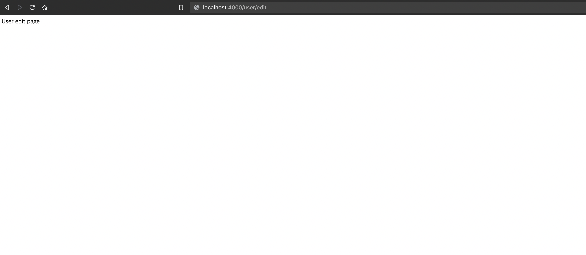

# Learn my self | node project handling and express

express를 공부하며 적어나갑니다.  
node 프로젝트를 처음 접하기에 설명이 부실합니다.

---

## set-up recap

1. 프로젝트 디렉토리 내부에 `npm init` 커맨드를 입력한다.

2. `package.json`을 완성시킨다.  
   _package.js은 text로 이루어진 프로젝트의 정보를 제공하는 문서일 뿐이니 완벽하게 작성하지 않더라도 추후에 수정을 통하여 완성시키면 된다. 자주 수정하게 되니 강박을 갖지 않아도 된다._
3. express, babel 등 필요한 dependencies를 `npm i`를 활용하여 추가한다. 이때, package.json을 작업창에서 닫은 뒤 추가하는 것을 추천하고 node\*moduls이라는 디렉토리가 자동으로 추가되면 성공적으로 추가 된 것이다.  
   _`node_modules`의 이름으로 된 디렉토리는 공유할 필요가 없다. package.json에 기록된 정보들을 통하여 npm으로 한번에 필요한 패키지들의 버전까지 맞춰 한번에 추가가 가능하다_

> 💡 프로젝트를 편하게 해주는 devDependencies : [babel install nodeJS](https://babeljs.io/setup#installation) ES6를 컴파일 시켜주는 역할, [nodemon](https://babeljs.io/setup#installation) 파일저장 시 자동으로 npm run 커맨드를 재입력해 주는 역할

---

## server recap

**nodeJS**에서 **express**를 사용하여 서버를 만들 시 간략한 세팅 방법에 대하여 알아보자.

### 서버 리스닝 기능

1. 우선 서버의 역할을 해줄 js 파일을 생성

2. 이후 파일 내부에 express를 import

3. 사용될 변수를 생성하고 바로 사용할 수 있도록 리턴시킨다

```jsx
import express from "express";

const app = express();
```

4. 리스닝 함수를 추가

```jsx
import express from "express";

const app = express();

const listeningMyServer = () => console.log("Listening on port 4000");

app.listen(4000, listeningMyServer);
```

위 코드를 터미널을 통해 실행 시켜보자

```
$ npm run #{npm_run_script}
```

로그 기록은 아래와 같이 출력되어야 정상적으로 작동하는 것이다.

```log
Listening on port 4000
```

위와 같이 작동 중이라면 서버가 동작하고 있으며 동시에 리스닝 기능 또한 작동중인 것으로 확인 할 수 있다.

---

### 기본적인 route 작성법

express를 통해 서버와 통신하는 가장 보편적인 방법은 `get` api를 이용하여 통신을 하는 방법이 있다.  
요약하자면 특정 url을 브라우저 주소창에 입력 시 **브라우저**가 **서버**에 req를 보내고 **서버**가 **브라우저**에 요청한 내용을 보내는 방식이다.

`get`을 받은 뒤 들어갈 인자에 세부적인 내용만 넣어주면 되는 간단한 방법이다.

`app.get($route)` 에서는 `path`가 필요하다.  
path로는 url이 필요한것 이후엔 많은 핸들러(함수)가 들어갈 수 있다.

아래의 예시처럼 간단한 route를 작성해볼 수 있다.

```jsx
import express from "express";

const PORT = 4000;

const app = express();

const handleHome = () => console.log("Here is Home!");

app.get("/", handleHome);

const handleListening = () =>
  console.log(`✅ Server listeting on port ${PORT}`);

app.listen(PORT, handleListening);
```

로그기록

```log
Here is Home!
```

위처럼 로그 기록으로는 뜨지만 실제 브라우저에서는 res를 받고 있지 않아 에러를 띄우고 지속적으로 로딩 중일 것이다.

---

### 기본적인 controller 작성법

route 작성에서 알게되었듯 모든 라우트는 기본적으로 핸들러를 가지게 되고 핸들러를 통해 브라우저가 서버에 `req`를 보냈기 때문에 res를 주지 않는다면 이전 내용처럼 지속적으로 로딩을 할 것이다.

라우트 작성 시 가지게 된 핸들러는 controller가 되며 컨트롤러에는 `req`와 `res` 인자를 갖게 된다.  
인자의 이름인 `req`와 `res`는 중요하지 않고 순서가 중요하다.  
각 인자마다 여러 메소드가 존재하는데 여기서는 기본적인 `res.end()`와 `res.send()`만 짚고 넘어 갈 예정이다.

- `res.end()`는 아무 응답 없이 그저 연결을 종료 시킬 뿐이다.
- `res.send()`는 fn 안의 내용을 보내주는 응답을 주는 것이다.
  \*html로도 보낼 수 있다.

req를 서버로 보냈다면 반드시 res 받아줘야한다. 간단하게 표현하자면

> routes를 만들고 controllers를 만들어 서버와 기본적으로 통신하게 만드는 것이다.

가장 쉽게 볼 수 있는 에러로는 라우트 컨트롤러에 함수를 입력하지 않아 발생하는 에러가 잦게 발생 할 수 있다. 반드시 컨트롤러가 있어야 할 자리에는 함수를 입력해주어야 한다. `get`은 **반드시** 함수가 필요하다.

---

### middleware

middleware는 req와 res의 중간다리 역할을 해주는 소프트웨어라고 생각하면 된다. 라우트 작성시 url 다음 컨트롤러가 붙게 되는데 사실 모든 컨트롤러도 미들웨어가 될 수 있다. 가장 중요한 핵심은 컨트롤러 인자 중 `next()`함수가 붙는다는 점이다.

아래의 예시 코드를 참고해보자.

```jsx
// middlerware
const logger = (req, res, next) => {
  console.log("here is logger middleware!");
  next();
};

// controller
const home = (req, res) => {
  res.send("Hello world!");
};

app.get("/", logger, home);
```

라우트를 보면 url 뒤로 `logger`라는 핸들러가 하나 더 붙게 되었다. 위 코드에서 보이듯 라우트에서 로거로 우선 함수를 실행 시킨 뒤 응답을 하고 그 뒤로 홈이라는 컨트롤러가 실행되어 로그창에는 `here is logger middleware!`가 표기되고 `Hello world!`라는 문구는 브라우저에 프린트하게 된다.

미들웨어는 어떠한 컨트롤러가 res를 통신을 하기 전까지 모든 컨트롤러를 미들웨어라고 칭할 수 있다. 그러한 관례로 모든 마지막 컨트롤러 인자에는 `next` 함수를 포함시키지 않는다.

미들웨어를 하나의 라우트에만 사용 할 수도 있지만 `app.use()`를 활용하여 모든 컨트롤러 이전에 미들웨어를 작동 시킬 수도 있다.

```jsx
// middlerware
const logger = (req, res, next) => {
  console.log("here is logger middleware!");
  next();
};

// controller
const home = (req, res) => {
  res.send("Hello world!");
};

app.use(logger);
app.get("/", home);
```

위와 같이 실행해도 이전과 같은 결과를 얻을 수 있다. `app.use`는 모든 route에서 사용되는 middleware를 적용시킬 수 있다.

`use`를 활용하여 미들웨어를 글로벌하게 작동시킬려면 반드시 적용될 라우트 윗 라인에 입력되어있어야한다.

> 💡 express는 모든 걸 위에서 아래 순으로 실행시킨다. javascript와 같은 원리이기 때문이다.

---

### morgan

미들웨어를 직접 만들 수도 있지만 npm을 보면 유용한 미들웨어도 존재한다.

[morgan](https://www.npmjs.com/package/morgan)은 추가적인 로그 기록을 쉽게 볼 수 있는 패키지이다. 간단하게 morgan을 적용시켜보자.

```shell
$ npm i morgan
```

```jsx
import morgan from "morgan";

// 개발환경 시 dev
const logger = morgan("dev");

app.use(logger);
```

```shell
GET / 304 3.545 ms - -
```

위와 같이 적용될 수 있다.

이외에도 더욱 정교한 로그를 확인할 수 있다.  
위의 예시의 dev를 이용한 로그 확인은  
**method, path, status code, 응답시간** 순으로 알려준다.

이외에는

- combined
  - 시간
  - method
  - http version
  - status code
  - 사용 중인 브라우저
  - OS 정보
  - 등등
- common
  - 시간
  - method
  - path
  - http version
  - status code
- short
  - method
  - path
  - http version
  - status code
  - 응답시간
- tiny
  - method
  - path
  - status code
  - 응답시간

위와 같이 확인 할 수 있으니 필요에 맞게 사용 할 수 있다.

---

### Router ft.express

express에서 라우터를 바로 만드는 방법을 알기 이전에 라우터의 역할과 라우터에 무엇이 들어가는지 부터 정리하겠다.

**Router(라우터)**란 컨트롤러와 URL 관리를 보다 쉽게 해주는 구조이다.  
작은 어플리케이션이라고 보면 쉽다.

우선 URL을 관리하는 좋은 방법으로 주제에 맞게 그룹화 하는 것이 좋다.

url의 `/` 는 기본적으로 `home`의 역할을 한다. 메인 도메인을 통하여 접속 했을 경우 나오는 화면을 뜻한다.

```shell
# 필요한 url의 역할
edit_user
delete_user

# 주제로 묶는 방법
/user/edit
/user/delete
```

위와 같은 방식을 그룹화하여 관리하되 루트에 제일 가까운 url을 **글로벌 라우터**라고 한다.

```shell
# global router
/login
/search
```

많은 웹서비스가 이런 방식으로 많이 이루어져 있다.

```shell
/github.com/goodvib2den
/github.com/goodvib2den/project
/github.com/goodvib2den/project/commit
```

위와 같은 방식으로 보기에 편하도록 그룹화를 이루어놓고 이 후 url을 쌓아가는 방식을 선호한다.

라우터를 만들어가는 명확한 기준은 없지만 그렇다고 하더라도 라우터를 만들어가는 과정에서 프로젝트에 쌓일 많은 url을 고려해가며 기초적인 구조를 그룹화하여 명확하게 구분하고 쌓아가는 것을 권장한다.

express에서 라우터는 만드는 방법은 아래와 같다.

```jsx
// global router
const globalRouter = express.Router();
const userRouter = express.Router();

// controller
const handleHome = (req, res) => res.send("Home");
const handleEditUser = (req, res) => res.send("user edit page");

// get
globalRouter.get("/", handleHome);
userRouter.get("/edit", handleEditUser);

// root url
app.use("/", globalRouter);
app.use("/user", ueserRouter);
```

위와 같은 식으로 라우터를 만들 수 있다.  
위 내용에서 `user` 라우터을 보게되면 `userRouter`에서 따로 url을 앞부분에 user를 넣어주지 않더라도 root url을 통해 찾게 된다면 하나의 라우터를 찾게되기 때문에 따로 만져주지 않더라도 뒤 함수를 실행 시켜준다.

쉽게 예를 들어 실행하는 브라우저에 직접 입력 해 보자.



위와 같이 시작하는 라우터의 root url과 직접 라우터의 get함수에서 넣어준 url 인자를 붙여 제대로 브라우저 상 표기가 되는 것을 확인 할 수 있다.

위처럼 코드를 지속적으로 작성해주어도 좋지만 코드를 분리하여 관리하면 더욱 편리해진다.

파일을 하나씩 **모듈화**하여 관리하는 것이 유용하다.  
아래와 같이 모듈화 해볼 수 있다. _(자바스크립트 모듈화 등으로 검색하면 쉽게 찾을 수 있으니 확인해보기 바란다.)_

```jsx
import express from "express";

// 라우터가 지속적으로 커질 수 있으니 파일 분리 후 import
import globalRouter from "./router/globalRouter";
import artworksRouter from "./router/artworksRouter";

const PORT = 4000;

const app = express();
const logger = morgan("dev");

app.use(logger);

// root
app.use("/", globalRouter);
app.use("/artworks", artworksRouter);

const handleListening = () =>
  console.log(`✅ Server listeting on port ${PORT}`);

app.listen(PORT, handleListening);
```

위 처럼 작성하게 될 시 당장의 서버파일의 라인이 간결해지고 라우터의 길어지는 라인을 따로 관리 할 수 있게되어 코드 자체의 가독성이 늘어난다.

위의 분리된 파일의 모듈의 간략한 이해는 맨 첫번째 라인인 `express`도 같은 점이다.
